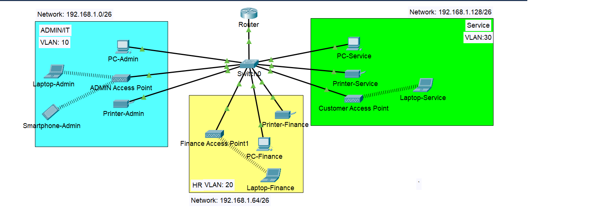
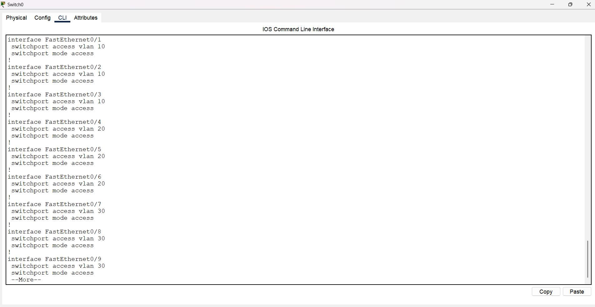
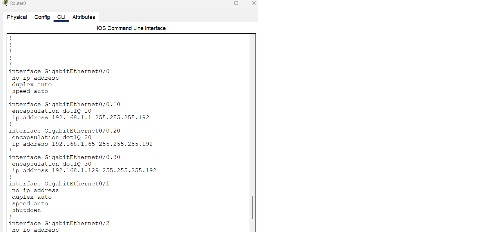
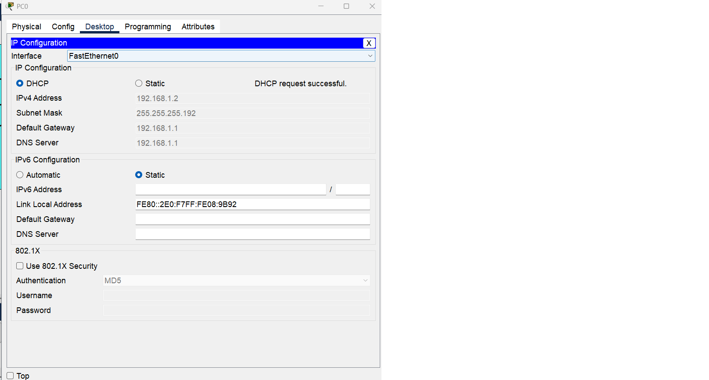

# Branch Office Network Design and Implementation Using Cisco Packet Tracer

## Description

The **Branch Office Network Design and Implementation** project focuses on designing and implementing a small-scale, cost-effective network.

The network supports:

- Departmental segmentation using VLANs  
- Inter-department communication using Router-on-a-Stick (ROAS)  
- Wireless connectivity for users  
- Automatic IPv4 address allocation using DHCP  

The design follows a **Collapsed Core (Two-Tier) Architecture**, using a single Cisco router and a single Cisco Layer 2 switch. This approach is well-suited for small branch offices where simplicity, cost efficiency, and scalability are key requirements.

---

## Objectives

- **Collapsed Core Network Architecture**  
  Design a two-tier architecture suitable for a small branch office.

- **VLAN Segmentation**  
  Logically isolate departments using VLANs to improve security and manageability.

- **Inter-VLAN Communication**  
  Enable communication between VLANs using Router-on-a-Stick.

- **Wireless Network Deployment**  
  Provide wireless access for users in each department.

- **DHCP Configuration**  
  Automate IPv4 address assignment for all wired and wireless hosts.

- **Scalable Design**  
  Allow future expansion with minimal architectural changes.

---

## Environment Used

- **Cisco Packet Tracer**

---

## Overall Network Architecture

This network uses a **Collapsed Core (Two-Tier) Architecture**, where:

- The **switch** performs both access and distribution layer functions  
- The **router** performs core routing and inter-VLAN routing  

### Architecture Justification

- The branch office is small and requires only one router and one switch  
- A traditional three-tier architecture would be unnecessary and costly  
- Router-on-a-Stick enables efficient inter-VLAN routing using a single router interface  

---

## Network Topology




---

## VLAN and Subnet Assignments

| VLAN ID | Department            | Subnet              | Default Gateway |
|--------|-----------------------|---------------------|-----------------|
| VLAN 10 | Admin / IT            | 192.168.1.0/26      | 192.168.1.1     |
| VLAN 20 | Finance / HR          | 192.168.1.64/26     | 192.168.1.65    |
| VLAN 30 | Customer Service      | 192.168.1.128/26    | 192.168.1.129   |

**Subnet Mask for all VLANs:**  
```
255.255.255.192 (/26)
```

---

## IP Subnetting

- ISP provided base network: `192.168.1.0/24`
- Number of required networks: `3`

### Resulting Subnets

- `192.168.1.0 – 192.168.1.63`
- `192.168.1.64 – 192.168.1.127`
- `192.168.1.128 – 192.168.1.191`

---

## Switch Configuration

---

### Access Port Configuration (Assigning PCs to the Correct VLANs)

Switch ports connected to end devices are configured as **access ports** and assigned to the appropriate VLANs using interface ranges.

#### VLAN 10 (Admin / IT) — Ports Fa0/1 to Fa0/3
These ports connect to Admin / IT devices and are placed in VLAN 10.

```
enable
configure terminal

interface range fa0/1-3
 switchport mode access
 switchport access vlan 10
```

#### VLAN 20 (Finance / HR) — Ports Fa0/4 to Fa0/6
These ports connect to Finance / HR devices and are placed in VLAN 20.

```
interface range fa0/4-6
 switchport mode access
 switchport access vlan 20
```

#### VLAN 30 (Customer Service) — Ports Fa0/7 to Fa0/9
These ports connect to Customer Service devices and are placed in VLAN 30.

```
interface range fa0/7-9
 switchport mode access
 switchport access vlan 30
```

---

### Trunk Port Configuration (Switch → Router)

```
interface GigabitEthernet0/1
 switchport mode trunk
```

This trunk link carries traffic for VLANs 10, 20, and 30 between the switch and the router.

---

## Router Configuration

### Enabling Router-on-a-Stick

```
interface GigabitEthernet0/0
 no shutdown
```

---

### Subinterface Configuration

```
interface gig0/0.10
 encapsulation dot1Q 10
 ip address 192.168.1.1 255.255.255.192

interface gig0/0.20
 encapsulation dot1Q 20
 ip address 192.168.1.65 255.255.255.192

interface gig0/0.30
 encapsulation dot1Q 30
 ip address 192.168.1.129 255.255.255.192
```

Each subinterface acts as the **default gateway** for its respective VLAN.

---

## DHCP Configuration

```
service dhcp

ip dhcp pool Admin-Pool
 network 192.168.1.0 255.255.255.192
 default-router 192.168.1.1
 dns-server 192.168.1.1

ip dhcp pool Finance-Pool
 network 192.168.1.64 255.255.255.192
 default-router 192.168.1.65
 dns-server 192.168.1.65

ip dhcp pool Service-Pool
 network 192.168.1.128 255.255.255.192
 default-router 192.168.1.129
 dns-server 192.168.1.129
```

---

## Wireless Network Configuration

Each department is provided with a dedicated wireless access point connected to the appropriate VLAN access port.

| Department          | SSID            | VLAN |
|---------------------|-----------------|------|
| Admin / IT          | ADMIN_WIFI      | 10   |
| Finance / HR        | FINANCE_WIFI    | 20   |
| Customer Service    | SERVICE_WIFI    | 30   |

Wireless security is configured using **WPA2-PSK** authentication.

---


