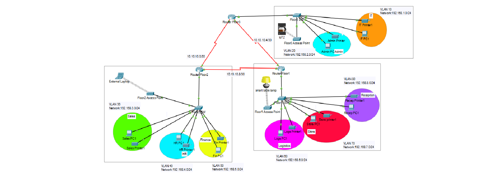

# Multi-Floor Office Network Design and Implementation Using Cisco Packet Tracer

---

## Description

The **Multi-Floor Office Network Design and Implementation** project focuses on designing and implementing a structured, scalable, and fully functional enterprise network for a three-floor office environment.

Each floor hosts multiple departments that require logical separation, reliable connectivity, wireless access, and centralized routing. The network is designed to ensure efficient communication between all departments while maintaining proper segmentation using VLANs.

Key features of the network include:
- Department-based VLAN segmentation  
- Inter-VLAN communication using Router-on-a-Stick  
- Inter-floor connectivity using point-to-point router links  
- Dynamic IP address allocation using DHCP  
- Wired and wireless device integration  

The project was implemented and tested using **Cisco Packet Tracer**.

---

## Architecture and Justification

### Architecture Used
**Hierarchical Network Architecture with a Collapsed Core (Two-Tier Design)**



### Architecture Breakdown
- **Collapsed Core / Distribution Layer**
  - Implemented using three routers (one per floor)
  - Routers handle:
    - Inter-VLAN routing
    - Inter-floor routing
    - DHCP services
    - OSPF dynamic routing

- **Access Layer**
  - One Layer 2 switch per floor
  - Provides:
    - End-device connectivity
    - VLAN enforcement
    - Wireless access point connectivity

### Why This Architecture Was Chosen
- The office network is small-to-medium in size
- A full three-tier architecture would be unnecessary and costly
- Collapsed core design provides:
  - Simplicity
  - Scalability
  - Ease of management
  - Real-world enterprise relevance

This architecture closely resembles real small office style deployments.

---

## VLAN and Subnet Assignments

### Floor 1 – Reception, Store, Logistics

| VLAN ID | Department   | Network            | Default Gateway |
|------|-------------|--------------------|----------------|
| 80   | Reception   | 192.168.8.0/24     | 192.168.8.1   |
| 70   | Store       | 192.168.7.0/24     | 192.168.7.1   |
| 60   | Logistics   | 192.168.6.0/24     | 192.168.6.1   |

---

### Floor 2 – Finance, HR, Sales

| VLAN ID | Department | Network            | Default Gateway |
|------|-----------|--------------------|----------------|
| 50   | Finance   | 192.168.5.0/24     | 192.168.5.1   |
| 40   | HR        | 192.168.4.0/24     | 192.168.4.1   |
| 30   | Sales     | 192.168.3.0/24     | 192.168.3.1   |

---

### Floor 3 – IT and Admin

| VLAN ID | Department | Network            | Default Gateway |
|------|-----------|--------------------|----------------|
| 20   | Admin     | 192.168.2.0/24     | 192.168.2.1   |
| 10   | IT        | 192.168.1.0/24     | 192.168.1.1   |

---

## Router Interconnections

Routers are interconnected using **point-to-point serial links** to simulate a WAN-style backbone between floors.

### Inter-Router IP Addressing (/30 Subnets)

| Link | Network | Router IPs |
|----|--------|-----------|
| Floor2 ↔ Floor3 | 10.10.10.0/30 | 10.10.10.1, 10.10.10.2 |
| Floor3 ↔ Floor1 | 10.10.10.4/30 | 10.10.10.5, 10.10.10.6 |
| Floor2 ↔ Floor1 | 10.10.10.8/30 | 10.10.10.9, 10.10.10.10 |

## Router Configuration

### Clock Rate Configuration on Router 3

Router 3 is configured to provide clocking on its serial interfaces.

```
enable
configure terminal

interface Serial0/3/0
 clock rate 64000
 no shutdown

interface Serial0/3/1
 clock rate 64000
 no shutdown

interface GigabitEthernet0/0
 no shutdown
```

---

### Clock Rate Configuration on Router 2

Router 2 is configured with clock rate on one serial interface.

```
enable
configure terminal

interface Serial0/3/1
 clock rate 64000
```

## Switch Configuration

### VLAN Configuration on Floor 1 Switch

```
interface range fa0/5-6
 switchport mode access
 switchport access vlan 80

interface range fa0/3-4
 switchport mode access
 switchport access vlan 70

interface range fa0/1-2
 switchport mode access
 switchport access vlan 60

interface g0/1
 switchport mode trunk

do write
```

---

### VLAN Configuration on Floor 2 Switch

```
interface range fa0/5-6
 switchport mode access
 switchport access vlan 50

interface range fa0/3-4
 switchport mode access
 switchport access vlan 40

interface range fa0/1-2
 switchport mode access
 switchport access vlan 30

interface g0/1
 switchport mode trunk
```

---

### VLAN Configuration on Floor 3 Switch

```
interface range fa0/3-4
 switchport mode access
 switchport access vlan 20

interface range fa0/1-2
 switchport mode access
 switchport access vlan 10

interface g0/1
 switchport mode trunk
```

### Inter-Router Serial Link Configuration

### Floor 1 Router (R1)

```
enable
configure terminal

interface Serial0/3/1
 ip address 10.10.10.9 255.255.255.252

interface Serial0/3/0
 ip address 10.10.10.5 255.255.255.252

do write
```

---

### Floor 2 Router (R1)

```
enable
configure terminal

interface Serial0/3/1
 ip address 10.10.10.10 255.255.255.252

interface Serial0/3/0
 ip address 10.10.10.1 255.255.255.252

do write
```

---

### Floor 3 Router (R1)

```
enable
configure terminal

interface Serial0/3/1
 ip address 10.10.10.6 255.255.255.252

interface Serial0/3/0
 ip address 10.10.10.2 255.255.255.252

do write
```

## Router Configuration

### VLAN Subinterface Configuration on Floor 1 Router

```
enable
configure terminal

interface g0/0.60
 encapsulation dot1Q 60
 ip address 192.168.6.1 255.255.255.0

interface g0/0.70
 encapsulation dot1Q 70
 ip address 192.168.7.1 255.255.255.0

interface g0/0.80
 encapsulation dot1Q 80
 ip address 192.168.8.1 255.255.255.0
```

---

### DHCP Configuration on Floor 1 Router

```
service dhcp

ip dhcp pool reception
 network 192.168.8.0 255.255.255.0
 default-router 192.168.8.1
 dns-server 192.168.8.1

ip dhcp pool store
 network 192.168.7.0 255.255.255.0
 default-router 192.168.7.1
 dns-server 192.168.7.1
 exit

ip dhcp pool logistics
 network 192.168.6.0 255.255.255.0
 default-router 192.168.6.1
 dns-server 192.168.6.1

do write
```

## Router Configuration

### VLAN Subinterface Configuration on Floor 2 Router

```
enable
configure terminal

interface g0/0.30
 encapsulation dot1Q 30
 ip address 192.168.3.1 255.255.255.0

interface g0/0.40
 encapsulation dot1Q 40
 ip address 192.168.4.1 255.255.255.0

interface g0/0.50
 encapsulation dot1Q 50
 ip address 192.168.5.1 255.255.255.0

do write
```

---

### DHCP Configuration on Floor 2 Router

```
service dhcp

ip dhcp pool sales
 network 192.168.3.0 255.255.255.0
 default-router 192.168.3.1
 dns-server 192.168.3.1

ip dhcp pool HR
 network 192.168.4.0 255.255.255.0
 default-router 192.168.4.1
 dns-server 192.168.4.1

ip dhcp pool finance
 network 192.168.5.0 255.255.255.0
 default-router 192.168.5.1
 dns-server 192.168.5.1

do write
```
### VLAN Subinterface Configuration on Floor 3 Router

```
interface g0/0.10
 encapsulation dot1Q 10
 ip address 192.168.1.1 255.255.255.0

interface g0/0.20
 encapsulation dot1Q 20
 ip address 192.168.2.1 255.255.255.0
```

---

### DHCP Configuration on Floor 3 Router

```
service dhcp

ip dhcp pool IT
 network 192.168.1.0 255.255.255.0
 default-router 192.168.1.1
 dns-server 192.168.1.1

ip dhcp pool Admin
 network 192.168.2.0 255.255.255.0
 default-router 192.168.2.1
 dns-server 192.168.2.1
```
---

## OSPF Configuration

### OSPF Configuration on Floor 2 Router

```
router ospf 1
 network 10.10.10.0 255.255.255.252 area 0
 network 10.10.10.8 255.255.255.252 area 0
 network 192.168.3.0 255.255.255.0 area 0
 network 192.168.4.0 255.255.255.0 area 0
 network 192.168.5.0 255.255.255.0 area 0

do write
```

---

### OSPF Configuration on Floor 1 Router

```
router ospf 1
 network 10.10.10.4 255.255.255.252 area 0
 network 10.10.10.8 255.255.255.252 area 0
 network 192.168.8.0 255.255.255.0 area 0
 network 192.168.7.0 255.255.255.0 area 0
 network 192.168.6.0 255.255.255.0 area 0

do write
```

---

### OSPF Configuration on Floor 3 Router

```
router ospf 1
 network 10.10.10.0 255.255.255.252 area 0
 network 10.10.10.4 255.255.255.252 area 0
 network 192.168.1.0 255.255.255.0 area 0
 network 192.168.2.0 255.255.255.0 area 0

do write
```
