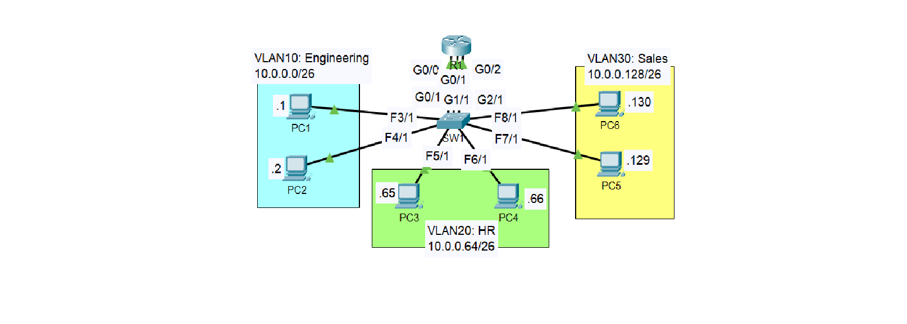

# VLAN & Inter-VLAN Routing Learning


---

### Network Topology  
*(Packet Tracer Diagram)*  


# 1. Understanding Why These Default Gateways Were Used

Your network uses **three /26 subnets**.  
A /26 mask = 255.255.255.192

Block size = 256 – 192 = **64**

So the networks are:

- 10.0.0.0/26  
- 10.0.0.64/26  
- 10.0.0.128/26  
- 10.0.0.192/26 (unused)

---

## VLAN10 – Engineering (10.0.0.0/26)

**Subnet breakdown:**

- Network ID: 10.0.0.0  
- Broadcast: 10.0.0.63  
- Usable Range: 10.0.0.1 – 10.0.0.62

**Default Gateway = last usable = 10.0.0.62**

**PCs:**
- PC1 → 10.0.0.1  
- PC2 → 10.0.0.2  
- Netmask → 255.255.255.192  
- Gateway → 10.0.0.62  

---

## VLAN20 – HR (10.0.0.64/26)

**Subnet breakdown:**

- Network ID: 10.0.0.64  
- Broadcast: 10.0.0.127  
- Usable Range: 10.0.0.65 – 10.0.0.126

**Default Gateway = last usable = 10.0.0.126**

**PCs:**
- PC3 → 10.0.0.65  
- PC4 → 10.0.0.66  
- Netmask → 255.255.255.192  
- Gateway → 10.0.0.126  

---

## VLAN30 – Sales (10.0.0.128/26)

**Subnet breakdown:**

- Network ID: 10.0.0.128  
- Broadcast: 10.0.0.191  
- Usable range: 10.0.0.129 – 10.0.0.190

**Default Gateway = 10.0.0.190**

**PCs:**
- PC5 → 10.0.0.129  
- PC6 → 10.0.0.130  
- Gateway → 10.0.0.190  

---

# 2. Router Interface IP Addressing

You assigned:

- G0/0 → 10.0.0.62  (gateway for VLAN10)  
- G0/1 → 10.0.0.126 (gateway for VLAN20)  
- G0/2 → 10.0.0.190 (gateway for VLAN30)  

These are the “default gateways” because the router sits between VLANs and routes traffic.

To configure:

```
en
conf t
int g0/0
 ip address 10.0.0.62 255.255.255.192
 no shutdown

int g0/1
 ip address 10.0.0.126 255.255.255.192
 no shutdown

int g0/2
 ip address 10.0.0.190 255.255.255.192
 no shutdown
```

---

# 3. Switch VLAN Configuration Explained

### VLAN 10 (Engineering)

```
int range g0/1, f3/1, f4/1
switchport mode access
switchport access vlan 10
```

**Meaning:**
- `switchport mode access`  
  Forces port to act as an access port (not trunk).
- `switchport access vlan 10`  
  Assigns the port to VLAN 10’s broadcast domain.

Ports in VLAN 10:
- PC1  
- PC2  
- Router G0/0  

---

### VLAN 20 (HR)

```
int range g1/1, f5/1, f6/1
switchport mode access
switchport access vlan 20
```

Ports in VLAN 20:
- PC3  
- PC4  
- Router G0/1  

---

### VLAN 30 (Sales)

```
int range g2/1, f7/1, f8/1
switchport mode access
switchport access vlan 30
```

Ports in VLAN 30:
- PC5  
- PC6  
- Router G0/2  

---

# 4. How the Router Performs Inter-VLAN Routing

This is **not router-on-a-stick**.  
This uses **three physical router interfaces**, one per VLAN.

### How routing works:

### Step 1: PC sends traffic to gateway  
Example: PC1 (10.0.0.1) → PC4 (10.0.0.66)

PC1 sees PC4 is outside its subnet → forwards to gateway 10.0.0.62.

---

### Step 2: Router receives packet  
Router routing table has:

```
C 10.0.0.0/26   is directly connected via G0/0
C 10.0.0.64/26  is directly connected via G0/1
C 10.0.0.128/26 is directly connected via G0/2
```

Router knows exactly where each VLAN network is located.

---

### Step 3: Router forwards to correct interface  
Since 10.0.0.66 belongs to 10.0.0.64/26, router forwards packet:

```
OUT: G0/1 (VLAN20)
```

---

### Step 4: Switch delivers to correct host  
Switch receives frame on VLAN 20 and sends it only to PC3/PC4 ports.

PC4 receives packet and replies the same path back.

---

# Final Summary

**Why those gateways?**  
Because they are the *last usable* IPs in each /26 subnet.

**Why switchport mode access?**  
To place ports in a single VLAN.

**Why switchport access vlan X?**  
To assign ports to the correct broadcast domain.

**How router routes between VLANs?**  
Because each router interface is a different subnet, and routers route between directly connected networks automatically.


